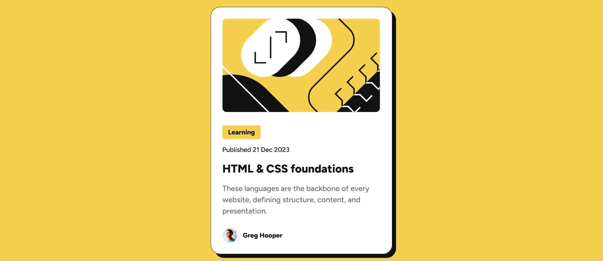

# Frontend Mentor - Blog preview card solution

This is a solution to the [Blog preview card challenge on Frontend Mentor](https://www.frontendmentor.io/challenges/blog-preview-card-ckPaj01IcS). Frontend Mentor challenges help you improve your coding skills by building realistic projects. 

## Table of contents

- [Overview](#overview)
  - [The challenge](#the-challenge)
  - [Screenshot](#screenshot)
  - [Links](#links)
- [My process](#my-process)
  - [Built with](#built-with)
  - [Useful resources](#useful-resources)
- [Author](#author)

**Note: Delete this note and update the table of contents based on what sections you keep.**

## Overview

### The challenge

Users should be able to:

- See hover and focus states for all interactive elements on the page

### Screenshot

### Links

- Solution URL: [https://katherin467.github.io/fm-preview-card]

## My process

### Built with

- Semantic HTML5 markup
- CSS custom properties
- Flexbox
- Mobile-first workflow

### Useful resources

- [W3Schools - object-fit](https://www.w3schools.com/csS/css3_object-fit.asp) - This helped me set up the specific way that the main image resizes across different screen widths.
- [CSS Tricks - viewport sized typography](https://css-tricks.com/viewport-sized-typography/) - This is a great article which helped me understand font resizing based on screen size without the use of media queries.

## Author

- Website - [Katherine Lim](https://katherin467.github.io/)
- Frontend Mentor - [@katherin467](https://www.frontendmentor.io/profile/katherin467)
